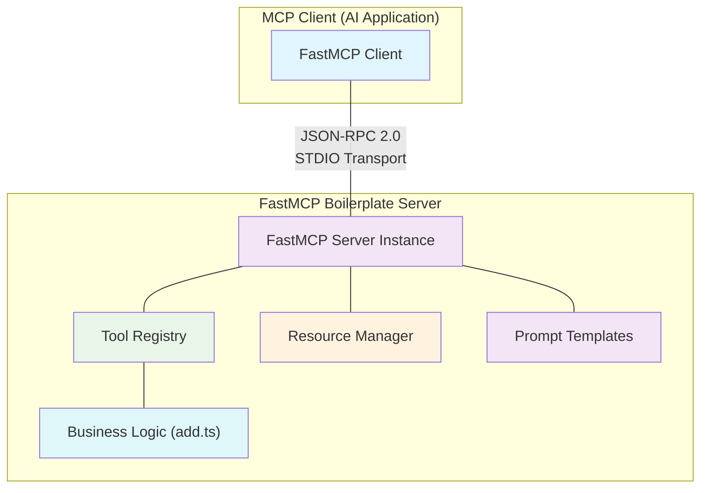

# FastMCP Boilerplate: LLM-Optimized Specification

## 1. Project Overview

**FastMCP Boilerplate** is a foundational starter template for constructing Model Context Protocol (MCP) servers utilizing the **FastMCP** framework. This specification is designed for Large Language Models (LLMs) to comprehend the project's architecture, capabilities, and development patterns. The primary goal is to provide a clear, robust, and extensible foundation for building AI-driven contextual services.

This boilerplate serves as a practical demonstration of MCP best practices, focusing on a clean architecture, type safety, and a streamlined development workflow.

## 2. Core Architectural Principles

The architecture is designed for clarity, maintainability, and scalability, centering on the effective implementation of MCP primitives.

### 2.1. Key Components

The project is structured with a clear separation of concerns:

-   **Server Implementation (`src/server.ts`)**: The central hub for the MCP server, responsible for defining and registering all MCP primitives (Tools, Resources, Prompts).
-   **Business Logic (`src/add.ts`)**: Encapsulates the core logic executed by tools. This separation allows business logic to be tested independently of the MCP framework.
-   **Unit Testing (`src/add.test.ts`)**: Ensures the reliability and correctness of the business logic.
-   **Development Environment**: A suite of tools configured for a seamless and efficient development experience, including type checking, linting, and formatting.

### 2.2. Technical Architecture Diagram

The data flow and component interactions are illustrated below. The server communicates with the MCP client (e.g., an AI application) via the STDIO transport, using the JSON-RPC 2.0 protocol.



## 3. MCP Primitives: Core Capabilities

This boilerplate provides concrete implementations for each of the three core MCP primitives.

### 3.1. Tools

Tools are executable functions that an AI can invoke to perform specific actions. They represent the active capabilities of the server.

#### **Addition Tool (`add`)**

-   **Purpose**: A fundamental arithmetic tool that calculates the sum of two numbers. It serves as a clear example of a pure, stateless function exposed as a tool.
-   **Input Validation**: Utilizes a `Zod` schema to define and enforce the input structure, ensuring type safety and data integrity at runtime. This is a critical pattern for robust tool design.
-   **AI-Optimization Annotations**:
    -   `readOnlyHint: true`: Signals to the LLM that this tool does not modify any state or have side effects.
    -   `openWorldHint: false`: Informs the LLM that the tool operates in a closed environment and does not interact with external systems (e.g., APIs, filesystems).
-   **Implementation Pattern**:

    ```typescript
    // src/server.ts
    import { add } from "./add.js";
    import { z } from "zod";

    server.addTool({
      // Annotations provide crucial metadata for the LLM's tool-use strategy.
      annotations: {
        title: "Addition",
        readOnlyHint: true,
        openWorldHint: false,
      },
      name: "add",
      description: "Calculates the sum of two numbers.",
      // Zod schema ensures runtime validation of arguments.
      parameters: z.object({
        a: z.number().describe("The first number for the addition."),
        b: z.number().describe("The second number for the addition."),
      }),
      // The execute function calls the isolated business logic.
      execute: async (args) => {
        return String(add(args.a, args.b));
      },
    });
    ```

### 3.2. Resources

Resources are data sources that provide contextual information to the AI. They represent the knowledge base the server can offer.

#### **Application Logs Resource**

-   **Purpose**: A mock resource that simulates access to an application's log file. This demonstrates how to expose static or dynamic data sources to an AI.
-   **URI Identification**: Identified by a unique URI (`file:///logs/app.log`), following MCP conventions for resource location.
-   **MIME Type**: Specifies the data format (`text/plain`), allowing the client to correctly interpret the content.
-   **Asynchronous Loading**: The `load` function is asynchronous, representing a best practice for fetching data from sources like filesystems or databases without blocking the server.
-   **Implementation Pattern**:

    ```typescript
    // src/server.ts
    server.addResource({
      uri: "file:///logs/app.log",
      name: "Application Logs",
      mimeType: "text/plain",
      // The `load` function is called by the MCP client to retrieve the resource content.
      async load() {
        // In a real-world scenario, this would read from a file or database.
        return {
          text: "INFO: Server started successfully.\nWARN: Deprecated feature in use.\nERROR: Connection to database failed.",
        };
      },
    });
    ```

### 3.3. Prompts

Prompts are reusable templates that structure interactions with the LLM, guiding it to perform specific tasks in a consistent manner.

#### **Git Commit Message Generator (`git-commit`)**

-   **Purpose**: A prompt template designed to generate well-formatted Git commit messages based on a description of changes.
-   **Parameterization**: Accepts a `changes` argument, making the prompt dynamic and reusable for different contexts.
-   **Contextual Instruction**: The template provides clear instructions to the LLM, defining the desired output format and tone. This is a key aspect of effective prompt engineering.
-   **Implementation Pattern**:

    ```typescript
    // src/server.ts
    server.addPrompt({
      name: "git-commit",
      description: "Generate a Git commit message based on a summary of changes.",
      // Defines the arguments the prompt template requires.
      arguments: [
        {
          name: "changes",
          description: "A Git diff or a natural language description of the code changes.",
          required: true,
        },
      ],
      // The `load` function constructs the final prompt string for the LLM.
      load: async (args) => {
        return `Generate a concise and descriptive Git commit message following conventional commit standards for the following changes:\n\n${args.changes}`;
      },
    });
    ```

## 4. Development Environment & Workflow

This boilerplate is configured to provide a highly efficient and reliable development workflow.

### 4.1. Technology Stack

-   **Runtime**: Node.js 22
-   **Language**: TypeScript (with strict type checking)
-   **Framework**: FastMCP
-   **Schema Validation**: Zod
-   **Testing**: Vitest
-   **Code Quality**: ESLint, Prettier, Perfectionist

### 4.2. Project Structure

The project follows a logical and intuitive structure:

```
.
├── src/
│   ├── server.ts     # MCP Server Definition & Entry Point
│   ├── add.ts        # Business Logic for the 'add' tool
│   └── add.test.ts   # Unit tests for 'add.ts'
├── package.json      # Project metadata and dependencies
├── tsconfig.json     # TypeScript compiler configuration
└── eslint.config.ts  # ESLint configuration
```

### 4.3. Development Commands

-   **`npm install`**: Installs all necessary dependencies.
-   **`npm run dev`**: Starts the interactive development server using `fastmcp dev`. This is the primary command for local development, providing a CLI to test and interact with the server in real-time.
-   **`npm run start`**: Runs the compiled server using `tsx`. Suitable for production-like execution.
-   **`npm run test`**: Executes the unit test suite using Vitest to validate business logic.
-   **`npm run lint`**: Analyzes the code for quality and style issues.
-   **`npm run format`**: Automatically formats the entire codebase according to Prettier rules.

## 5. Extensibility and Best Practices

This boilerplate is designed to be a starting point. The following guidelines ensure that extensions are consistent, robust, and maintainable.

### 5.1. Adding New Tools

1.  **Isolate Logic**: Implement the core functionality in a new file within `src/` (e.g., `src/my-logic.ts`).
2.  **Write Tests**: Create a corresponding `src/my-logic.test.ts` file to ensure the logic is correct and reliable.
3.  **Define Schema**: In `src/server.ts`, define a Zod schema for the tool's parameters. A well-defined schema is crucial for both validation and for the LLM to understand how to use the tool.
4.  **Register Tool**: Use `server.addTool()` in `src/server.ts`, importing the business logic and linking it to the tool definition.
5.  **Add Annotations**: Provide `readOnlyHint` and `openWorldHint` annotations to guide the LLM's usage of the new tool.

### 5.2. Security and Reliability

-   **Input Validation**: Always use Zod schemas for all tool and prompt arguments to prevent invalid or malicious inputs.
-   **Error Handling**: Within tool logic, handle potential errors gracefully. The FastMCP framework will catch unhandled exceptions, but explicit error handling is preferred. Use the `UserError` class from FastMCP for errors that should be displayed to the end-user.
-   **Separation of Concerns**: Keep business logic separate from the MCP server implementation. This improves testability, reusability, and maintainability.

# Directory Structure
```
.github/
  workflows/
    feature.yaml
    main.yaml
src/
  add.test.ts
  add.ts
  server.ts
.gitignore
eslint.config.ts
LICENSE
package.json
README.md
tsconfig.json
```

# Files

## File: .github/workflows/feature.yaml
````yaml
 1: name: Run Tests
 2: on:
 3:   pull_request:
 4:     branches:
 5:       - main
 6:     types:
 7:       - opened
 8:       - synchronize
 9:       - reopened
10:       - ready_for_review
11: jobs:
12:   test:
13:     runs-on: ubuntu-latest
14:     name: Test
15:     strategy:
16:       fail-fast: true
17:       matrix:
18:         node:
19:           - 22
20:     steps:
21:       - name: Checkout repository
22:         uses: actions/checkout@v4
23:         with:
24:           fetch-depth: 0
25:       - name: Setup NodeJS ${{ matrix.node }}
26:         uses: actions/setup-node@v4
27:         with:
28:           node-version: ${{ matrix.node }}
29:       - name: Install dependencies
30:         run: npm install
31:       - name: Run lint
32:         run: npm run lint
33:       - name: Run tests
34:         run: npm run test
````

## File: .github/workflows/main.yaml
````yaml
 1: name: Release
 2: on:
 3:   push:
 4:     branches:
 5:       - main
 6: jobs:
 7:   test:
 8:     environment: release
 9:     name: Test
10:     strategy:
11:       fail-fast: true
12:       matrix:
13:         node:
14:           - 22
15:     runs-on: ubuntu-latest
16:     permissions:
17:       contents: write
18:       id-token: write
19:     steps:
20:       - name: setup repository
21:         uses: actions/checkout@v4
22:         with:
23:           fetch-depth: 0
24:       - name: setup node.js
25:         uses: actions/setup-node@v4
26:         with:
27:           node-version: ${{ matrix.node }}
28:       - name: Setup NodeJS ${{ matrix.node }}
29:         uses: actions/setup-node@v4
30:         with:
31:           node-version: ${{ matrix.node }}
32:       - name: Install dependencies
33:         run: npm install
34:       - name: Run lint
35:         run: npm run lint
36:       - name: Run tests
37:         run: npm run test
38:       - name: Build
39:         run: npm run build
40:       - name: Release
41:         run: npx semantic-release
42:         env:
43:           GITHUB_TOKEN: ${{ secrets.GITHUB_TOKEN }}
44:           NPM_TOKEN: ${{ secrets.NPM_TOKEN }}
````

## File: src/add.test.ts
````typescript
1: import { expect, it } from "vitest";
2: 
3: import { add } from "./add.js";
4: 
5: it("should add two numbers", () => {
6:   expect(add(1, 2)).toBe(3);
7: });
````

## File: src/add.ts
````typescript
1: export const add = (a: number, b: number) => a + b;
````

## File: src/server.ts
````typescript
 1: import { FastMCP } from "fastmcp";
 2: import { z } from "zod";
 3: 
 4: import { add } from "./add.js";
 5: 
 6: const server = new FastMCP({
 7:   name: "Addition",
 8:   version: "1.0.0",
 9: });
10: 
11: server.addTool({
12:   annotations: {
13:     openWorldHint: false, // This tool doesn't interact with external systems
14:     readOnlyHint: true, // This tool doesn't modify anything
15:     title: "Addition",
16:   },
17:   description: "Add two numbers",
18:   execute: async (args) => {
19:     return String(add(args.a, args.b));
20:   },
21:   name: "add",
22:   parameters: z.object({
23:     a: z.number().describe("The first number"),
24:     b: z.number().describe("The second number"),
25:   }),
26: });
27: 
28: server.addResource({
29:   async load() {
30:     return {
31:       text: "Example log content",
32:     };
33:   },
34:   mimeType: "text/plain",
35:   name: "Application Logs",
36:   uri: "file:///logs/app.log",
37: });
38: 
39: server.addPrompt({
40:   arguments: [
41:     {
42:       description: "Git diff or description of changes",
43:       name: "changes",
44:       required: true,
45:     },
46:   ],
47:   description: "Generate a Git commit message",
48:   load: async (args) => {
49:     return `Generate a concise but descriptive commit message for these changes:\n\n${args.changes}`;
50:   },
51:   name: "git-commit",
52: });
53: 
54: server.start({
55:   transportType: "stdio",
56: });
````

## File: .gitignore
````
1: dist
2: node_modules
````

## File: eslint.config.ts
````typescript
 1: import eslint from "@eslint/js";
 2: import eslintConfigPrettier from "eslint-config-prettier/flat";
 3: import perfectionist from "eslint-plugin-perfectionist";
 4: import tseslint from "typescript-eslint";
 5: 
 6: export default tseslint.config(
 7:   eslint.configs.recommended,
 8:   tseslint.configs.recommended,
 9:   perfectionist.configs["recommended-alphabetical"],
10:   eslintConfigPrettier,
11:   {
12:     ignores: ["**/*.js"],
13:   },
14: );
````

## File: LICENSE
````
 1: The MIT License (MIT)
 2: =====================
 3: 
 4: Copyright © 2025 Frank Fiegel (frank@glama.ai)
 5: 
 6: Permission is hereby granted, free of charge, to any person
 7: obtaining a copy of this software and associated documentation
 8: files (the “Software”), to deal in the Software without
 9: restriction, including without limitation the rights to use,
10: copy, modify, merge, publish, distribute, sublicense, and/or sell
11: copies of the Software, and to permit persons to whom the
12: Software is furnished to do so, subject to the following
13: conditions:
14: 
15: The above copyright notice and this permission notice shall be
16: included in all copies or substantial portions of the Software.
17: 
18: THE SOFTWARE IS PROVIDED “AS IS”, WITHOUT WARRANTY OF ANY KIND,
19: EXPRESS OR IMPLIED, INCLUDING BUT NOT LIMITED TO THE WARRANTIES
20: OF MERCHANTABILITY, FITNESS FOR A PARTICULAR PURPOSE AND
21: NONINFRINGEMENT. IN NO EVENT SHALL THE AUTHORS OR COPYRIGHT
22: HOLDERS BE LIABLE FOR ANY CLAIM, DAMAGES OR OTHER LIABILITY,
23: WHETHER IN AN ACTION OF CONTRACT, TORT OR OTHERWISE, ARISING
24: FROM, OUT OF OR IN CONNECTION WITH THE SOFTWARE OR THE USE OR
25: OTHER DEALINGS IN THE SOFTWARE.
````

## File: package.json
````json
 1: {
 2:   "name": "fastmcp-boilerplate",
 3:   "version": "1.0.0",
 4:   "main": "dist/index.js",
 5:   "scripts": {
 6:     "build": "tsc",
 7:     "start": "tsx src/server.ts",
 8:     "dev": "fastmcp dev src/server.ts",
 9:     "lint": "prettier --check . && eslint . && tsc --noEmit",
10:     "test": "vitest run",
11:     "format": "prettier --write . && eslint --fix ."
12:   },
13:   "keywords": [
14:     "fastmcp",
15:     "mcp",
16:     "boilerplate"
17:   ],
18:   "repository": {
19:     "url": "https://github.com/punkpeye/fastmcp-boilerplate"
20:   },
21:   "author": "Frank Fiegel <frank@glama.ai>",
22:   "homepage": "https://glama.ai/mcp",
23:   "type": "module",
24:   "license": "MIT",
25:   "description": "A boilerplate for FastMCP",
26:   "dependencies": {
27:     "fastmcp": "^1.27.3",
28:     "zod": "^3.24.4"
29:   },
30:   "release": {
31:     "branches": [
32:       "main"
33:     ],
34:     "plugins": [
35:       "@semantic-release/commit-analyzer",
36:       "@semantic-release/release-notes-generator",
37:       "@semantic-release/npm",
38:       "@semantic-release/github"
39:     ]
40:   },
41:   "devDependencies": {
42:     "@eslint/js": "^9.26.0",
43:     "@tsconfig/node22": "^22.0.1",
44:     "eslint-config-prettier": "^10.1.3",
45:     "eslint-plugin-perfectionist": "^4.12.3",
46:     "jiti": "^2.4.2",
47:     "prettier": "^3.5.3",
48:     "semantic-release": "^24.2.3",
49:     "tsx": "^4.19.4",
50:     "typescript": "^5.8.3",
51:     "typescript-eslint": "^8.32.0",
52:     "vitest": "^3.1.3"
53:   }
54: }
````

## File: README.md
````markdown
 1: # FastMCP Boilerplate
 2: 
 3: A boilerplate for [FastMCP](https://github.com/punkpeye/fastmcp).
 4: 
 5: This boilerplate is a good starting point for building an MCP server. It includes a basic setup for testing, linting, formatting, and publishing to NPM.
 6: 
 7: ## Development
 8: 
 9: To get started, clone the repository and install the dependencies.
10: 
11: ```bash
12: git clone https://github.com/punkpeye/fastmcp-boilerplate.git
13: cd fastmcp-boilerplate
14: npm install
15: npm run dev
16: ```
17: 
18: > [!NOTE]
19: > If you are starting a new project, you may want to fork [fastmcp-boilerplate](https://github.com/punkpeye/fastmcp-boilerplate) and start from there.
20: 
21: ### Start the server
22: 
23: If you simply want to start the server, you can use the `start` script.
24: 
25: ```bash
26: npm run start
27: ```
28: 
29: However, you can also interact with the server using the `dev` script.
30: 
31: ```bash
32: npm run dev
33: ```
34: 
35: This will start the server and allow you to interact with it using CLI.
36: 
37: ### Testing
38: 
39: A good MCP server should have tests. However, you don't need to test the MCP server itself, but rather the tools you implement.
40: 
41: ```bash
42: npm run test
43: ```
44: 
45: In the case of this boilerplate, we only test the implementation of the `add` tool.
46: 
47: ### Linting
48: 
49: Having a good linting setup reduces the friction for other developers to contribute to your project.
50: 
51: ```bash
52: npm run lint
53: ```
54: 
55: This boilerplate uses [Prettier](https://prettier.io/), [ESLint](https://eslint.org/) and [TypeScript ESLint](https://typescript-eslint.io/) to lint the code.
56: 
57: ### Formatting
58: 
59: Use `npm run format` to format the code.
60: 
61: ```bash
62: npm run format
63: ```
64: 
65: ### GitHub Actions
66: 
67: This repository has a GitHub Actions workflow that runs linting, formatting, tests, and publishes package updates to NPM using [semantic-release](https://semantic-release.gitbook.io/semantic-release/).
68: 
69: In order to use this workflow, you need to:
70: 
71: 1. Add `NPM_TOKEN` to the repository secrets
72:    1. [Create a new automation token](https://www.npmjs.com/settings/punkpeye/tokens/new)
73:    2. Add token as `NPM_TOKEN` environment secret (Settings → Secrets and Variables → Actions → "Manage environment secrets" → "release" → Add environment secret)
74: 1. Grant write access to the workflow (Settings → Actions → General → Workflow permissions → "Read and write permissions")
````

## File: tsconfig.json
````json
1: {
2:   "extends": "@tsconfig/node22/tsconfig.json",
3:   "compilerOptions": {
4:     "outDir": "dist"
5:   },
6:   "include": ["src"]
7: }
````
